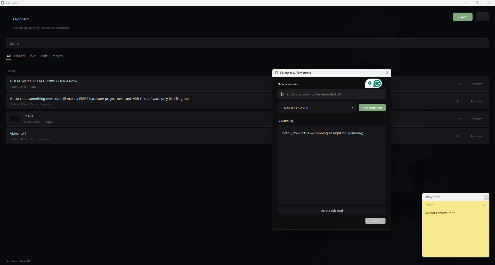

# Clipboard

A desktop clipboard manager built with PySide6. It watches your clipboard, keeps a searchable history, and also has manual entries, reminders with desktop notifications, and an always-on-top STICKY NOTE.

It's a single Python file and uses SQLite so everything stays on your machine.



## Features

- Copy text, code, links, or images. They show up in a history list, newest first, grouped by day. Click an item to copy it again. If you copy the same thing twice, it just updates the timestamp instead of creating a duplicate.
- `+ Add` (`Ctrl+N`) adds an entry manually without touching your clipboard. You can give it a name, an optional description, and force a type (Link/Code/Image) if auto-detection gets it wrong.
- Reminders: set a title, description, and due time. You get a tray notification when it fires. The app has to be running, but the tray is enough.
- Sticky note: a small always-on-top note window. It persists across restarts, including its position.

## Installing

Requires Python 3.9+ and PySide6. Tested on Python 3.12 / PySide6 6.11.

```bash
pip install PySide6
python clipboard_plus.py
```

The app starts minimized in the tray. Double-click the icon to open it.

## Shortcuts that you can use:

| Action | Shortcut |
|---|---|
| Add to clipboard | `Ctrl+N` |
| Jump to search | `Ctrl+F` |
| Clear search / hide window | `Esc` |
| Copy item back | Click a row |
| Pin / unpin / remove / open link | Right-click a row |
| Open link or GitHub row | Double-click |

Settings, export, reminders, and the sticky note toggle live behind the `···` button. You can also get to them from the tray icon's right-click menu when the window is hidden.

## Where your data is stored:

- `~/.clipboard_plus/data.db` - SQLite database for entries, reminders, and sticky note text
- `~/.clipboard_plus/config.json` - background image, accent color, dim level, note position

Delete the folder to reset everything. It gets recreated with defaults on the next launch.

## License

MIT - free to use to use & no limits.
